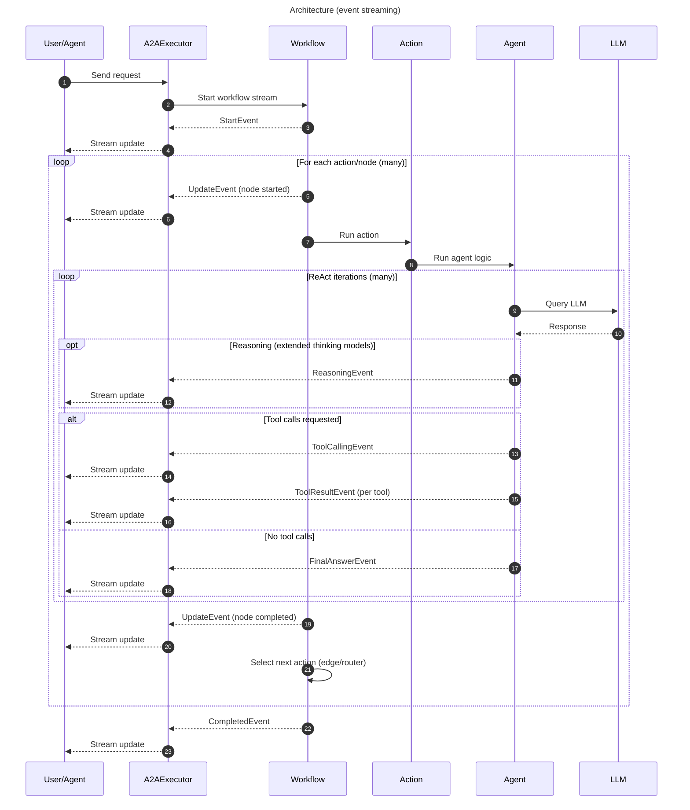

# Architecture Overview

## Components

| Module                         | Component                                                                                           | Responsibility                                                                                                                                                            |
| ------------------------------ | --------------------------------------------------------------------------------------------------- | ------------------------------------------------------------------------------------------------------------------------------------------------------------------------- |
| <nobr>`ant_ai.agent`</nobr>    | [`Agent`][ant_ai.agent.agent.Agent]                                                                 | Core reasoning unit. Runs the ReAct loop: queries the LLM, executes tool calls, and streams events until a final answer is reached.                                       |
| <nobr>`ant_ai.workflow`</nobr> | [`Workflow`][ant_ai.workflow.workflow.Workflow]                                                     | Directed graph of nodes (actions) connected by static edges or conditional routers. Orchestrates what the agent does and in what order.                                   |
| <nobr>`ant_ai.tools`</nobr>    | [`Tool`][ant_ai.tools.tool.Tool]                                                                    | Callables exposed to the LLM via JSON schema. Defined with the `@tool` decorator or as a `Tool` subclass for grouped namespaces.                                          |
|                                | [`ToolRegistry`][ant_ai.tools.registry.ToolRegistry]                                                | Built automatically from the agent's tool list. Expands namespace tools into individually callable entries.                                                               |
| <nobr>`ant_ai.a2a`</nobr>      | [`Colony`][ant_ai.a2a.colony.Colony]                                                                | Multi-agent coordinator. Registers agents with their workflows and A2A cards, wires collaboration edges, and produces ASGI apps for deployment.                           |
|                                | [`A2AExecutor`][ant_ai.a2a.executor.A2AExecutor]                                                    | ASGI request handler. Receives incoming A2A requests, initialises `InvocationContext` and `State`, drives `Workflow.stream()`, and translates events to A2A task updates. |
|                                | [`A2AAgentTool`][ant_ai.a2a.agent.A2AAgentTool]                                                     | A `Tool` that calls a remote agent over HTTP. Added to source agents automatically by `Colony.collab()`.                                                                  |
| <nobr>`ant_ai.core`</nobr>     | [`AgentEvent`][ant_ai.core.events.AgentEvent] / [`WorkflowEvent`][ant_ai.core.events.WorkflowEvent] | Typed events emitted by the agent and workflow respectively. All progress — LLM output, tool calls, node transitions — is observable through this stream.                 |

A high level view of the interaction of these components is shown below:


## Flow of a Request

In the A2A integration, [`A2AExecutor.execute()`][ant_ai.a2a.executor.A2AExecutor.execute] acts as the streaming entrypoint: it ensures there is an active [`Task`](https://a2a-protocol.org/latest/sdk/python/api/a2a.html#a2a.types.Task), builds an [`InvocationContext`][ant_ai.core.types.InvocationContext] and initial [`State`][ant_ai.core.types.State] (including converted history), then consumes the asynchronous event stream produced by [`Workflow.stream()`][ant_ai.workflow.workflow.Workflow]. The workflow is a directed graph of actions (nodes) connected by static edges or conditional routers; it opens with a [`StartEvent`][ant_ai.core.events.StartEvent], wraps each node in a pair of [`UpdateEvent`][ant_ai.core.events.UpdateEvent]s (node started / node completed), and closes with a [`CompletedEvent`][ant_ai.core.events.CompletedEvent]. Within each node the [`Agent`][ant_ai.agent.agent.Agent] runs its ReAct loop, emitting [`ReasoningEvent`][ant_ai.core.events.ReasoningEvent] (extended-thinking models only), [`ToolCallingEvent`][ant_ai.core.events.ToolCallingEvent] / [`ToolResultEvent`][ant_ai.core.events.ToolResultEvent] for each tool round-trip, and finally a [`FinalAnswerEvent`][ant_ai.core.events.FinalAnswerEvent] when the LLM produces a plain-text response. Every event is translated via [`HVEventToA2A.apply()`][ant_ai.a2a.translator.HVEventToA2A.apply] and applied to the task through [`TaskUpdater`](https://a2a-protocol.org/latest/sdk/python/api/a2a.server.tasks.html#a2a.server.tasks.TaskUpdater), streaming incremental updates back to the client until the workflow reaches a terminal state.



## Events

Every step of agent and workflow execution is observable through a stream of typed events. All events extend [`Event`][ant_ai.core.events.Event].

### Workflow events

Emitted by [`Workflow`][ant_ai.workflow.workflow.Workflow] to signal lifecycle transitions and node progress.

| Class                                                 | `kind`        | When emitted                                                                   |
| ----------------------------------------------------- | ------------- | ------------------------------------------------------------------------------ |
| [`StartEvent`][ant_ai.core.events.StartEvent]         | `"start"`     | Workflow begins execution                                                      |
| [`UpdateEvent`][ant_ai.core.events.UpdateEvent]       | `"update"`    | Node started (`"Starting action 'X'"`) or completed (`"Completed action 'X'"`) |
| [`CompletedEvent`][ant_ai.core.events.CompletedEvent] | `"completed"` | Workflow finished successfully; `content` holds the final answer               |

### Agent events

Emitted by the agent's ReAct loop during LLM calls and tool execution.

| Class                                                                     | `kind`                | When emitted                                                                                                   |
| ------------------------------------------------------------------------- | --------------------- | -------------------------------------------------------------------------------------------------------------- |
| [`ReasoningEvent`][ant_ai.core.events.ReasoningEvent]                     | `"reasoning"`         | Model produced extended thinking / reasoning text (before the answer)                                          |
| [`ToolCallingEvent`][ant_ai.core.events.ToolCallingEvent]                 | `"tool_calling"`      | LLM response contains tool calls; `message` holds the [`ToolCallMessage`][ant_ai.core.message.ToolCallMessage] |
| [`ToolResultEvent`][ant_ai.core.events.ToolResultEvent]                   | `"tool_result"`       | One tool call completed; `content` holds the result                                                            |
| [`FinalAnswerEvent`][ant_ai.core.events.FinalAnswerEvent]                 | `"final_answer"`      | LLM produced a plain-text response (no tool calls); ends the ReAct loop                                        |
| [`MaxStepsReachedEvent`][ant_ai.core.events.MaxStepsReachedEvent]         | `"max_steps_reached"` | Agent exhausted its maximum allowed ReAct steps                                                                |
| [`ClarificationNeededEvent`][ant_ai.core.events.ClarificationNeededEvent] | `"input_required"`    | Agent determined it needs human input to proceed                                                               |

### Consuming events

```python
from ant_ai.core.events import (
    StartEvent, UpdateEvent, CompletedEvent,
    ReasoningEvent, ToolCallingEvent, ToolResultEvent,
    FinalAnswerEvent, MaxStepsReachedEvent,
)

async for event in workflow.stream(agent, ctx=ctx, state=state):
    match event:
        case StartEvent():
            print("workflow started")
        case UpdateEvent():
            print("node update:", event.content, f"[{event.origin.node}]")
        case ReasoningEvent():
            print("thinking:", event.content)
        case ToolCallingEvent():
            print("calling tools:", event.message)
        case ToolResultEvent():
            print("tool result:", event.content)
        case FinalAnswerEvent():
            print("answer:", event.content)
        case CompletedEvent():
            print("workflow done:", event.content)
```
