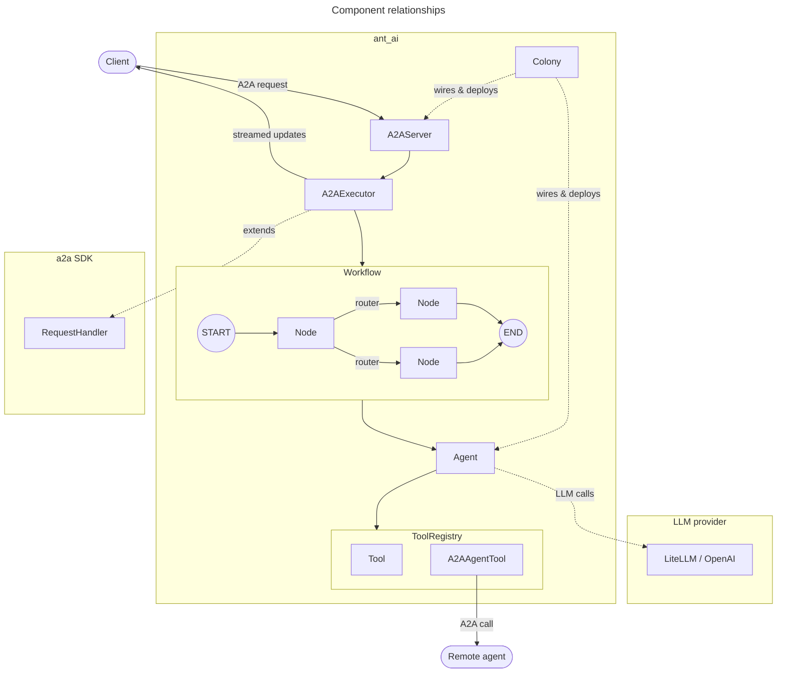
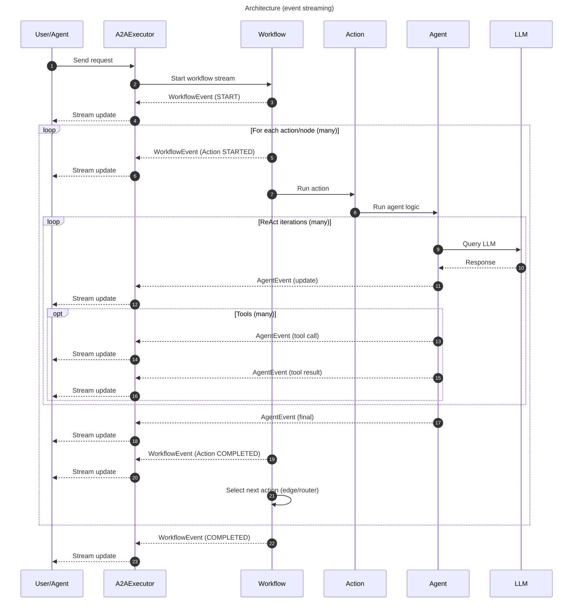

# Architecture Overview

## Components

| Module                           | Component                                                                                               | Responsibility                                                                                                                                                                    |
| -------------------------------- | ------------------------------------------------------------------------------------------------------- | --------------------------------------------------------------------------------------------------------------------------------------------------------------------------------- |
| <nobr>`ant_ai.agent`</nobr>    | [`Agent`][ant_ai.agent.agent.Agent]                                                                   | Core reasoning unit. Runs the ReAct loop: queries the LLM, executes tool calls, and streams events until a final answer is reached.                                               |
| <nobr>`ant_ai.workflow`</nobr> | [`Workflow`][ant_ai.workflow.workflow.Workflow]                                                       | Directed graph of nodes (actions) connected by static edges or conditional routers. Orchestrates what the agent does and in what order.                                           |
| <nobr>`ant_ai.tools`</nobr>    | [`Tool`][ant_ai.tools.tool.Tool]                                                                      | Callables exposed to the LLM via JSON schema. Defined with the `@tool` decorator or as a `Tool` subclass for grouped namespaces.                                                  |
|                                  | [`ToolRegistry`][ant_ai.tools.registry.ToolRegistry]                                                  | Built automatically from the agent's tool list. Expands namespace tools into individually callable entries.                                                                       |
| <nobr>`ant_ai.a2a`</nobr>      | [`Colony`][ant_ai.a2a.colony.Colony]                                                                        | Multi-agent coordinator. Registers agents with their workflows and A2A cards, wires collaboration edges, and produces ASGI apps for deployment.                                   |
|                                  | [`A2AExecutor`][ant_ai.a2a.executor.A2AExecutor]                                                      | ASGI request handler. Receives incoming A2A requests, initialises `InvocationContext` and `State`, drives `Workflow.stream()`, and translates events to A2A task updates. |
|                                  | [`A2AAgentTool`][ant_ai.a2a.agent.A2AAgentTool]                                                       | A `Tool` that calls a remote agent over HTTP. Added to source agents automatically by `Colony.collab()`.                                                                            |
| <nobr>`ant_ai.core`</nobr>     | [`AgentEvent`][ant_ai.core.events.AgentEvent] / [`WorkflowEvent`][ant_ai.core.events.WorkflowEvent] | Typed events emitted by the agent and workflow respectively. All progress — LLM output, tool calls, node transitions — is observable through this stream.                         |

A high level view of the interaction of these components is shown below:

## Flow of a Request

In the A2A integration, [`A2AExecutor.execute()`][ant_ai.a2a.executor.A2AExecutor.execute] acts as the streaming entrypoint: it ensures there is an active [`Task`](https://a2a-protocol.org/latest/sdk/python/api/a2a.html#a2a.types.Task), builds an [`InvocationContext`][ant_ai.core.types.InvocationContext] and initial [`State`][ant_ai.core.types.State] (including converted history), then consumes the asynchronous event stream produced by [`Workflow.stream()`][ant_ai.workflow.workflow.Workflow]. The workflow is a graph of actions (nodes) connected by static edges or routers; each node execution emits [`WorkflowEvent`][ant_ai.core.events.WorkflowEvent] updates (started/completed/update) and may delegate to the [`Agent`][ant_ai.agent.agent.Agent] for LLM-driven logic (including tool calls), which surfaces as [`AgentEvent`][ant_ai.core.events.AgentEvent] (`update`, `tool_calling`, `tool_result`, `final`). Every event, whether originating from the workflow or the agent, is translated via [`HVEventToA2A.apply()`][ant_ai.a2a.translator.HVEventToA2A.apply] and applied to the task through [`TaskUpdater`](https://a2a-protocol.org/latest/sdk/python/api/a2a.server.tasks.html#a2a.server.tasks.TaskUpdater), resulting in incremental task updates being streamed back to the client; this makes progress observable end-to-end until the workflow emits a final `COMPLETED` event and the task reaches a terminal state.

