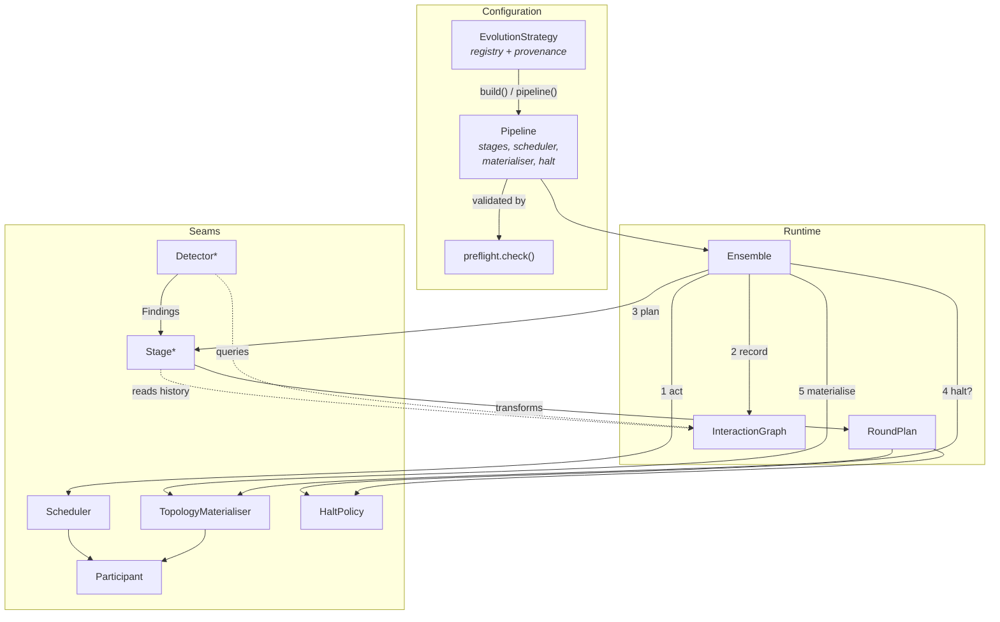
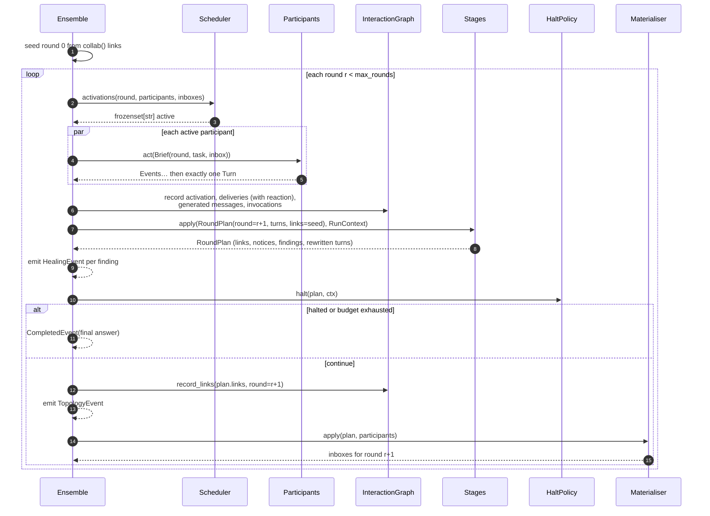
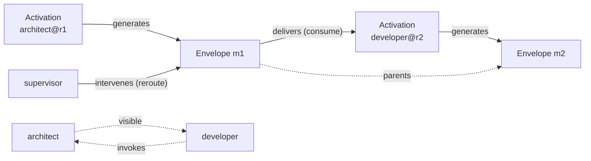
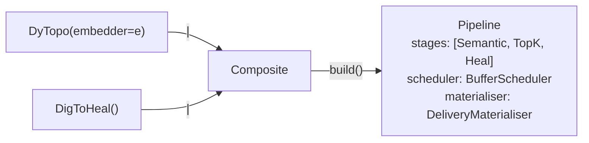
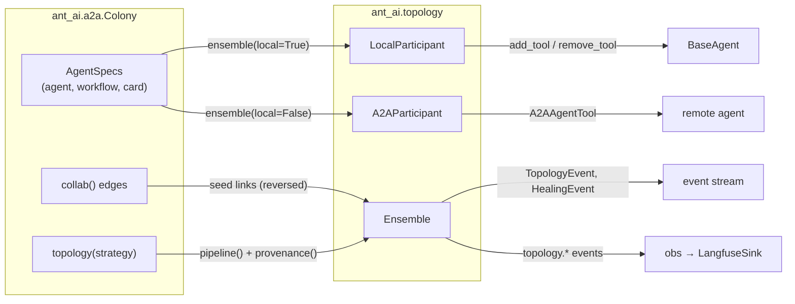

# Topology architecture

This document describes the internal architecture of `ant_ai.topology` — the adaptive topology
layer — and how it connects to the rest of the framework. It is the design companion to the
user-facing guide, [Adaptive topology](../multi-agent/topology.md): that page shows how to *use* a
strategy, this one explains what the layer is made of, why it is cut where it is cut, and which
invariants hold across it.

## 1. What the layer is for

A [`Colony`][ant_ai.a2a.colony.Colony] wires collaboration edges once, at construction, with
`collab()`. The topology layer recomputes them at runtime: **who may reach whom is decided per
round**, from what the run has actually done so far.

Everything in the layer follows from keeping two questions apart:

| | Question | Decided by |
| --- | --- | --- |
| **Reachability** | who is in my address book this round | the topology layer |
| **Selection** | whom I actually talk to | the participant — a peer tool call, or `Envelope.recipients` |

Recording those separately is what makes coordination pathologies observable at all: an edge that
was granted and never used is a fact only a record that distinguishes `visible` from `invokes`
edges can state. There is no router agent anywhere in the layer — routing decisions are mechanical
transforms over self-declared text and over the run record.

## 2. Package map

```
src/ant_ai/topology/
├── plan.py           the vocabulary every stage speaks (RoundPlan, RunContext, Stage, …)
├── rewrite.py        Rewrite — the typed operator set every edit is written in
├── state.py          StateGraph — the persistent, typed agent-state graph G(t)
├── log.py            RewriteLog — the append-only trail, with inverses and rollback
├── graph.py          InteractionGraph — the bipartite record of what actually happened
├── participant.py    Participant protocol, Turn/Envelope/Brief, Local & A2A adapters, PeerTool
├── schedule.py       Scheduler seam — who activates on a tick
├── cadence.py        Every — running a stage on a slower clock than the round loop
├── activate.py       recorded read-only selection (RecordingMemory, record_support)
├── materialise.py    TopologyMaterialiser seam — turning a decided plan into a constrained round
├── heal.py           Detector seam + the Heal stage that applies what detectors prescribe
├── strategy.py       Pipeline, EvolutionStrategy, HaltPolicy — packaging and composition
├── problem.py        Problem, TopologyConfigurationError — what a check reports
├── preflight.py      the checks that run before a single agent does
├── evaluate.py       graph-aware metrics (support accuracy, leakage, locality)
├── runtime.py        Ensemble — the round loop
└── builtins/         uses of the seams above, one module per published method
    ├── shapes.py     Static, chain/star/mesh, Baseline
    ├── dytopo.py     DyTopo (arXiv:2602.06039) + its sparsity-matched random control
    └── dig.py        DigToHeal (arXiv:2603.00309), its seven detectors, and the LLM-judge baseline
```

The split between the package root and `builtins/` is deliberate and load-bearing for readability:
**everything in the root is a seam, everything in `builtins/` is a use of one.** A reader can tell
which is which without opening a file, and adding a published method never edits the core.

## 3. Component relationships



`Detector` is drawn feeding a `Stage` because that is literally what it does: detectors are
collected by the concrete [`Heal`][ant_ai.topology.heal.Heal] stage, which is what turns their
prescriptions into edits.

## 4. The six seams

Each seam exists because published methods disagree about that specific question, and leaving the
disagreement implicit distorts comparisons rather than simplifying them.

| Seam | Question it answers | Default | Why it is a seam |
| --- | --- | --- | --- |
| [`Stage`][ant_ai.topology.plan.Stage] | how does the next round's plan change? | none | the single extension point for a routing or repair algorithm |
| [`Detector`][ant_ai.topology.heal.Detector] | what is structurally wrong right now? | none | repair mechanics are fixed; what varies is what counts as a failure |
| [`Scheduler`][ant_ai.topology.schedule.Scheduler] | who activates on this tick? | `RoundScheduler` (barrier) | under a hard barrier "work remains but nobody acted" is unreachable, so a stall detector is dead code |
| [`TopologyMaterialiser`][ant_ai.topology.materialise.TopologyMaterialiser] | how does a decided plan constrain a round? | `VisibilityMaterialiser` | peer tools vs routed messages are genuinely different mechanisms with different observability |
| [`HaltPolicy`][ant_ai.topology.strategy.HaltPolicy] | is the run over? | `Halt()` | agent-declared halting makes two conditions run for different round counts, so token totals stop being comparable |
| [`Participant`][ant_ai.topology.participant.Participant] | who is an addressable actor? | `LocalParticipant` | local in-process agents and remote A2A peers must be interchangeable |

A `Stage` deliberately holds **no participant handles, performs no I/O on the run and cannot
deliver anything**. That restriction is what lets a published method be replayed against a recorded
trace with no agents running, and what lets two methods compose by sitting next to each other in a
list rather than by inheritance.

## 5. What a stage may change

A stage's output is one or more typed **rewrites**. The operator set is the one in
[arXiv:2608.18104](https://arxiv.org/abs/2608.18104), which models agent evolution as dynamic graph
transformation:

| Operator | Eq. | What it does |
| --- | --- | --- |
| `insert` / `delete` | 3, 4 | add or remove a typed node |
| `feature_update` | 5 | revise a node's attributes, keeping its identity |
| `merge` | 6 | consolidate two nodes, archiving the originals with provenance edges |
| `link` / `unlink` | 7, 8 | add or remove a typed edge |
| `rewire` | 9 | redirect an edge, carrying its attributes across |
| `edge_feature_update` | 10 | revise an edge's attributes |
| `activate` | 11 | select a support subgraph — read-only, changes nothing |

Nodes are typed `agent`, `memory`, `tool`, `skill`, `workflow`, `message` or `activation`; edges are
`communication`, `dependency` or `provenance`. **Reachability is the communication-edge case of this
vocabulary** — `Link` and a `communication` edge are two spellings of one fact — which is why
`with_links()` still exists, still replaces the graph wholesale, and now records the diff that got
there. Everything else a method might evolve is the same operators on a different node kind.

The paper's double-pushout formulation (`L ← K → R`) is deliberately **not** implemented. It is a
proof that the operator set is closed and that deletion is well-behaved, not an implementation
strategy; what is kept is the fixed vocabulary, the dangling condition, and the fact that every edit
is a value that can be logged, inverted and replayed.

### Two graphs, kept apart

| | `InteractionGraph` | `StateGraph` |
| --- | --- | --- |
| Answers | what happened in this run | what the system *is* now |
| Nodes | activations, messages | agents, memories, tools, skills, workflows |
| Lifetime | one run | outlives any run |
| Time | `round` | validity intervals (`valid_from` / `valid_to`) |

Collapsing them would make the trace grow without bound and make "what does this agent know?"
answerable only by replaying every round it has ever taken. They share node ids and edge families,
so a cascade crossing from an observed message to a distilled skill follows an edge rather than
changing representation halfway.

### The trail

Every applied rewrite lands in [`RewriteLog`][ant_ai.topology.log.RewriteLog] paired with **the
inverse the state graph computed while applying it** — from the graph rather than from the rewrite,
because only the graph knew the before-state. That is what makes four questions answerable that a
record of *states* cannot answer at all:

| Question | Where |
| --- | --- |
| what must be revalidated after this edit? | `LogEntry.affected` — `StateGraph.affected()` at apply time |
| what would undoing it restore? | `RewriteLog.rollback(state, to=t)`, newest first |
| which edits did one cause produce? | `RewriteLog.cascade(cause)` — the paper's `C(c)` |
| did this touch more than one component type? | `RewriteLog.cross_component()` |

An edit the schema refuses is logged as **unapplied rather than raised**: the caller is a round loop
running somebody's published method, and killing the run over one malformed edit throws away the
trace that shows which edit it was. `RunReport.rejected` is how it surfaces.

### Two clocks

Cross-component co-evolution is a fast loop coupled to a slow one. With a single clock the two
collapse, and a method whose whole claim is that the slow loop is slow becomes a method that
rewires every round — which is the ablation it was compared against.
[`Every(stage, k=…)`][ant_ai.topology.cadence.Every] is the combinator; it forwards the wrapped
stage's declarations rather than answering for itself, and `W004` fires when a cadence cannot fit
inside the round budget.

## 6. The round loop

[`Ensemble.stream()`][ant_ai.topology.runtime.Ensemble] runs one loop order for every strategy,
because the pipeline always configures the **next** round rather than the current one.



Two orderings in that diagram are decisions, not accidents:

- **Halting is asked *after* the stages.** Repairing an early termination *un-terminates* a
  premature submit, and it can only do that if it runs before anyone asks whether the run is over.
- **The plan is numbered `r + 1`.** A plan governs the round it configures, so it is recorded
  against that round rather than the one that produced it.

### Turn-level detail

`Ensemble._act` never raises. A participant that throws is recorded as a failed
[`Activation`][ant_ai.topology.graph.Activation] with its error, and the round continues — letting
one agent's exception kill the ensemble would also throw away structural signal a detector wants to
see.

Two facts are normalised centrally rather than asked of the participant, in `Turn.recorded()`:

- **Lineage** (`Envelope.parents`) is what the turn *consumed*. A message left `wait`ing is not yet
  an ancestor of anything. Without attributed lineage, the two lineage detectors cannot run at all.
- **`Envelope.terminal`** is derived from `Turn.submitted`, so a hand-written `Participant` cannot
  set one and forget the other and silently disable every detector that looks for `e_inf`.

Participant events are streamed through an `asyncio.Queue` (`_live`) rather than gathered and then
drained, so a caller sees a participant's events as they happen. Exceptions are collected rather
than propagated — the coroutines record their own failures, and a raise would leave the queue with
no sentinel and the caller waiting forever.

## 7. Data model

### RoundPlan — one value, owned field by field

[`RoundPlan`][ant_ai.topology.plan.RoundPlan] is the single value every stage transforms. Making it
one type is what removed three separate hand-merges from the round loop (rewritten messages, links,
created messages).

| Field | Owner | Read by |
| --- | --- | --- |
| `round` | runtime | everything |
| `turns` | runtime; rewritten by `Heal` | scorers, halt policy, delivery |
| `scores` | a scoring stage (`Semantic`, `RandomScores`) | a sparsifying stage (`TopK`) |
| `links` | seeded from `collab()`; overwritten by a sparsifying or shape stage | materialiser, graph |
| `notices` | `Heal` | materialiser |
| `findings` | `Heal` | runtime (→ `HealingEvent`), reporting |

Stages return a **new** plan rather than mutating the one they were given. That immutability is
what keeps a pipeline from becoming a set of stages quietly depending on each other's leftovers.
[`RunContext`][ant_ai.topology.plan.RunContext] is the read-only counterpart — round, task,
profiles, who was active, and the whole graph — and keeping the two apart is what makes a stage
replayable against a recorded trace.

### InteractionGraph — bipartite by construction



[`InteractionGraph`][ant_ai.topology.graph.InteractionGraph] holds activations, messages and a flat
edge list with five kinds:

| Edge kind | Connects | Records |
| --- | --- | --- |
| `generates` | activation id → message id | which turn produced which message |
| `delivers` | message id → activation id | a delivery, labelled with the recipient's own reaction |
| `visible` | participant → participant | reachability the topology *granted* |
| `invokes` | participant → participant | calls an agent actually *chose* to make |
| `intervenes` | message (or participant) → recipient | a rewrite by a stage |

Design points worth stating explicitly:

- **Activations are per-round, not per-agent.** `architect@round1` and `architect@round2` are
  distinct nodes, so the same agent at different times never collapses into one vertex.
- **The record answers *what happened*, never *what it means*.** Whether an unconsumed message is a
  failure, or how long is too long for one to sit undelivered, is a published method's claim; those
  interpretations live in `builtins/dig.py` (`reachable_work`, `orphans`, `is_problem_reducing`),
  with the paper making them.
- **Healing leaves a trace.** Every intervention writes an `intervenes` edge with its reason,
  without which a repaired run and a run that never needed repairing are indistinguishable
  afterwards — and `ExcessiveRerouting` has nothing to count.
- **It is plain pydantic with no arbitrary types**, so a whole run round-trips through
  `model_dump_json()` and an analysis can be developed against recorded traces with no agents
  running. `snapshot(round)`, `links(round, kind=…)`, `unused_visibility(round)` and `to_mermaid()`
  are the projections built on that.
- **`siblings()` settles contributions, not messages.** A turn emits its contribution twice — once
  public, once private — and they are two visibilities of one event. Without settling them together,
  every public message in delivery mode looks permanently unconsumed and Early Termination fires on
  every round of a healthy run.

### Turn and Envelope

[`Turn`][ant_ai.topology.participant.Turn] is what one participant produced in one round:
`outputs` (a list, because one activation can legitimately send a different thing to each of several
agents), `reactions` and `rerouted` (what it did with what it received), `query`/`key` (the dynamic
half of its advertisement — the AgentCard is the static half), `invoked`, `submitted`, `error`.

Structured turns come from a single forward pass: [`TurnPayload`][ant_ai.topology.participant.TurnPayload]
is requested as the agent's `response_schema`, so message, addressing, reactions, query and key all
arrive together — asking for any of it in a second call would double the cost of every round for
nothing. A malformed payload degrades to a plain public message rather than failing the round.

`Brief.tags` gives each inbox message a short per-brief handle (`e1`, `e2`, …), because an agent
asked what it did with each message cannot be expected to quote back thirty-two hex characters. Tags
are resolved back to ids in `_reactions()`; anything that resolves to no live message is dropped
rather than guessed at.

## 8. Materialisation: the two mechanisms

A decided plan does nothing until a materialiser turns it into an actual constraint. There are two,
and they are observably different.

### VisibilityMaterialiser (default)

Reachability **is** the peer tool set. Each participant is bound to exactly the peers it can reach,
so its address book is the topology. Descriptions come from AgentCards as they always have, nothing
is injected into prompts, and the agent still decides whom to call.

!!! note "Edge direction reverses at the tool binding"
    `Link(src, dst)` is **information flow**: `src` offers, `dst` needs. So under visibility it is
    *`dst`* that gets a tool calling *`src`*. Under delivery, `src`'s message is pushed into `dst`'s
    inbox. The same arrow, two mechanisms.

Notices — messages a stage invented — still ride the brief's inbox even in visibility mode, because
there is no peer tool for a message nobody generated.

### DeliveryMaterialiser

Reachability as routed messages, with one rule covering both halves of the split the layer is built
on:

```
delivery = selection ∩ reachability
```

Each side has a default, and the defaults are what let two very different published methods share
one materialiser:

| Case | Behaviour |
| --- | --- |
| sender addressed nobody | routed by the links — a matcher-driven run |
| no stage wrote links | goes where it was addressed — agents naming their own correspondents, no matcher underneath |
| addressed to somebody unreachable | **not delivered** — it stays a generated event that reached no one, which is exactly what `OrphanedEvent` looks for |

Silently widening reachability to whoever was named would erase the pathology instead of reporting
it. Inboxes are ordered by descending relevance (from `RoundPlan.in_neighbours`), ties broken on
sender name so ablations reproduce, and deduplicated — a message can legitimately arrive twice
(waited on by its holder *and* rerouted to it in the same round), and an inbox with two copies would
make the record double-count a delivery that happened once.

### The round boundary

`RoundOutcome.carried` is the boundary's whole job: what a turn declined to settle (`wait`) is still
in front of it next round, and what it handed on (`reroute`) is in front of somebody else. Both
survive, which is what makes `wait` a decision rather than a way to lose a message. `_deliver()`
merges carried envelopes with freshly materialised ones.

## 9. Repair: Detector and Heal

`heal.py` splits *what is wrong* from *what to do about it*:

- [`Detector`][ant_ai.topology.heal.Detector] — one failure pattern, one `detect()` method returning
  `Finding`s. It is a concrete base rather than a protocol so that `finding()` is available to
  whoever writes one, and `async` because a detector may itself consult a model: the LLM-judge
  baseline is a `Detector` like any other, which is what makes comparing judged against structural
  repair a change of one list element.
- [`Heal`][ant_ai.topology.heal.Heal] — the concrete stage that runs a set of detectors and applies
  what they prescribe. Concrete rather than a seam of its own, because detectors vary and repair
  mechanics do not.

A detector that raises is skipped, not fatal: diagnostic machinery aborting the run it was meant to
protect would be exactly backwards.

`Intervention` has four kinds, dispatched through a handler table so that adding a kind is adding a
method and a row:

| Kind | Effect |
| --- | --- |
| `inject` | append text to a message, in place |
| `drop` | remove a message |
| `reroute` | carry *this* message to named recipients as a notice; un-terminates a submit |
| `emit` | create a new supervisor-authored message |

Two mechanics deserve their reasons restated:

- **A rewrite reaches the message wherever it lives.** If it belongs to a turn this round, that turn
  is rewritten so what gets delivered is the corrected text; if it is older, the graph's copy is the
  only copy and is edited in place. Only being able to repair the last round's messages would make
  the corrections for a stalled or ignored message unreachable exactly when they are needed.
- **A reroute is a notice, not a link.** A link says "whatever this agent says *next* goes there",
  which delivers the wrong message when the agent has moved on and nothing at all when it has fallen
  silent — the case every stall-shaped repair is trying to fix.

`Heal` never touches `plan.links`: repair moves messages, and leaves deciding who may reach whom to
the stage whose job that is.

## 10. Composition and provenance



- **`Pipeline.__or__` concatenates stages; the right-hand side wins on every other field** — but
  only fields it set *explicitly* (`model_fields_set`, not a value comparison), so composing never
  silently reverts a setting to a default just because the other side did not mention it.
- **`EvolutionStrategy.__or__` produces a `Composite`, not a folded `Pipeline`.** Returning the
  pipeline directly would record which components ran but lose which published methods and
  hyperparameters produced them.
- **A strategy has exactly one hook, `build()`.** It used to have five overridable hooks plus a
  bespoke layering field, which forced a method whose paper changes only supervision to state a
  routing choice it does not make.
- **Hyperparameters are pydantic fields**, because all three uses depend on it: validated at
  construction, varied by an ablation sweep, and read straight off `model_fields` for the run record.
- **Subclasses self-register by `name`**, so `EvolutionStrategy.create("dytopo", …)` is the path
  config-driven ablations take, and `provenance()` records method + hyperparameters on the run.
  Values that genuinely cannot serialise — a live embedder — fall back to their `model_id`.

## 11. Shipped strategies

| Strategy | `name` | Stages | Scheduler | Materialiser |
| --- | --- | --- | --- | --- |
| [`Baseline`][ant_ai.topology.builtins.shapes.Baseline] | `baseline` | none | round barrier | visibility |
| [`DyTopo`][ant_ai.topology.builtins.dytopo.DyTopo] | `dytopo` | `Semantic` → `TopK` | round barrier | delivery |
| [`RandomTopology`][ant_ai.topology.builtins.dytopo.RandomTopology] | `random` | `RandomScores` → `TopK(tau=None)` | round barrier | delivery |
| [`DigToHeal`][ant_ai.topology.builtins.dig.DigToHeal] | `dig` | `Heal(dig_detectors())` | **buffer** | delivery |
| [`JudgeHealing`][ant_ai.topology.builtins.dig.JudgeHealing] | `judge` | `Heal([LLMJudge])` | **buffer** | delivery |

`Static`, `chain()`, `star()` and `mesh()` are fixed shapes used as controls. They live in
`builtins/` rather than the core because **the core ships no concrete routing at all** — what
reachability should be is always somebody's choice, never a framework default.

### DyTopo — scoring and sparsifying are separate stages

The paper's two steps map to two stages, one each:

```
r_ij = q_i · k_j                        →  Semantic  (writes plan.scores)
A_j→i = 1(r_ij > τ)(1 − δ_ij)           →  TopK      (reads them, writes plan.links)
```

Keeping them apart is what makes the paper's own random control honest: `RandomScores` paired with
the *same* `TopK` holds sparsity constant by construction rather than by careful reimplementation.
`Semantic` falls back to profile text for a participant that declared no descriptors, and *reports*
that fallback — profile text does not change between rounds, so a run where everyone falls back
scores the same matrix every round and produces a topology that looks adaptive and never moves. When
the fallback is total it warns, because that is not degraded matching but no matching at all.

### DigToHeal — why its scheduler and materialiser are not cosmetic

Seven detectors, grouped by the paper into reachability/termination (ET, MC, OE, DL) and progress
(ER, CLA, RSP). Each is a query over the graph and each prescribes its own correction. Two of the
strategy's other choices are load-bearing:

- **`BufferScheduler`**, because a synchronous barrier makes `Deadlock` unreachable by construction:
  if everyone acts every round, an empty activation set never happens.
- **`DeliveryMaterialiser`**, because detection is defined over messages that exist, are delivered
  and are consumed — under visibility mode a peer call collapses all three into one tool call and
  there is nothing to inspect between them.

`Halt` is deliberately left at the framework default: repairing an early termination already
un-terminates a premature submit, which is the paper's own mechanism for the same problem and
strictly more informative than forbidding most participants from finishing.

## 12. Integration with the rest of the framework



### Colony

Two new methods, both additive — **a colony with no `topology()` call behaves exactly as before**:

- `Colony.evolve(strategy, detectors=…)` declares the strategy (and optionally a one-off `Heal`
  stage of extra detectors, for something that does not warrant its own strategy).
- `Colony.ensemble(local=…, use_workflows=…, max_rounds=…, materialiser=…)` builds the `Ensemble`.

Three details in `ensemble()` are worth knowing about:

1. **`collab()` edges are the standing topology, not just a seed.** The direction reverses:
   `collab(source, target)` means *source may call target*, so target is the one offering, and the
   link is `Link(src=target, dst=source)`. `Ensemble._plan` starts each round's plan with those
   links, so a stage that writes links overwrites them and a strategy that writes none — a pure
   repair strategy — routes over the colony's own wiring. Without that, `DigToHeal` alone left the
   plan empty and every unaddressed message reached nobody.
2. **`use_workflows` defaults to False and is checked, not inferred.** It used to be `None` and the
   colony guessed from the pipeline. A flag whose meaning depends on the stage list is one nobody
   can predict, so the guess is gone: structured turns are the default, workflows are opt-in, and
   asking for a combination that cannot work raises. A component still opts into the requirement
   with `needs_structured_turns = True`, read via `getattr` so the flag stays optional.
3. **The configuration is validated before it is returned.** `Colony.ensemble()` is the guided
   path; constructing `Ensemble(...)` directly is the escape hatch.

### Preflight

Every check in `preflight.py` corresponds to a run that used to complete and produce an artefact.
The rules fire only where the outcome is provable from the configuration alone — a check that
guessed would be another thing to work around.

| Code | Fires when | Was |
| --- | --- | --- |
| `E001` | a component needs structured turns and participants cannot produce them (remote, or `use_workflows=True`) | a matcher scoring static text, or detectors firing on defaults |
| `E002` | delivery mode, no link-writing stage, no declared edges, no addressing | every message generated and delivered to nobody |
| `E003` | remote participants with `VisibilityMaterialiser` and a deciding stage | a warning |
| `E004` | `use_workflows=True` with a workflow that fails `Workflow.check()` | every activation failing, and "Ensemble completed" with no messages |
| `W001` | nothing can declare `submitted` | the round budget silently deciding the run length |
| `W002` | a strategy over fewer than two participants | nothing |
| `W003` | a response schema requested while the agent has tools | a second LLM call per turn, declarations invented by a repair model |

`W003` is worth understanding rather than silencing. `Agent` builds a tool step only
when its registry is non-empty ([agent.py:23](../../../src/ant_ai/agent/agent.py)), and
the ReAct loop applies `response_schema` natively only when there is no tool step.
With tools — peer tools under visibility mode, or an agent's own — the schema becomes a
repair pass: the turn is generated as prose, then a second model converts it to
`TurnPayload`. Measured on one turn: **1 LLM call without tools, 2 with.** The cost is
the lesser problem; the fields in that second call are produced by a model that never
saw the topology contract, so `submitted` and `query` become inferences rather than
declarations. Both shipped strategies default to `DeliveryMaterialiser`, which binds no
peer tools, so they avoid it unless the agents carry tools of their own.

`E002` reads `Pipeline.writes_links`, declared by a stage with `writes_links = True` — the same
`getattr` idiom as `needs_structured_turns`, so a duck-typed stage is simply one that decides
nothing. `Static` and `TopK` declare it; `Heal` deliberately does not, because repair moves
messages and leaves reachability to the stage whose job it is.

Imports between `ant_ai.a2a.colony` and `ant_ai.topology` are lazy (function-local) or
`TYPE_CHECKING`-only, because `ant_ai.topology` imports `ant_ai.a2a.agent` and a module-level import
would cycle. Types remain real to a type checker and an IDE.

### Agent

Rebinding reachability requires removing tools as well as adding them, so
[`BaseAgent.remove_tool(name)`][ant_ai.agent.base.BaseAgent.remove_tool] was added as the
counterpart to `add_tool`: it unregisters from the registry, drops the tool from `tools`, and
hot-reloads the loop's step. `Agent.add_tool` was corrected to keep `tools` and the registry in step
in the same way.

[`PeerTool`][ant_ai.topology.participant.PeerTool] is how a local participant calls another. Peer
calls nest — an agent can call a peer that calls a peer, synchronously, inside one round — so depth
is tracked in a `ContextVar` and bounded by `Pipeline.max_depth`; past the bound the call returns a
refusal string rather than recursing.

### Events and observability

| Event | `kind` | Emitted when |
| --- | --- | --- |
| [`TopologyEvent`][ant_ai.core.events.TopologyEvent] | `"topology"` | a topology was decided for a round; `links` carries the edges with scores and reasons |
| `HealingEvent` | `"healing"` | a detector found a structural failure; carries pattern, detector and the intervention kinds |

Both extend `WorkflowEvent` and are members of the `AnyEvent` union.
[`TopologyLink`][ant_ai.core.events.TopologyLink] lives in `ant_ai.core.events` (and is re-exported
as `ant_ai.topology.Link`) so that the event schema does not depend on the topology package.

!!! note
    `TopologyEvent` and `TopologyLink` are re-exported from `ant_ai.core`; `HealingEvent` currently
    is not, and must be imported from `ant_ai.core.events`.

For structured observability, `Ensemble` emits `topology.start`, `topology.round.start`,
`topology.round.end`, `topology.match`, `topology.detect`, `topology.descriptors.missing`,
`topology.unbindable`, `topology.participant.error`, `topology.detector.error` and `topology.end`
through `obs`. Field names deliberately match the workflow lifecycle events (`node`, `run_step`), so
existing sinks pick them up unchanged; `LangfuseSink` maps the four lifecycle names onto its
existing workflow/node span handlers.

### Embeddings

A new `ant_ai.embeddings` package provides the [`Embedder`][ant_ai.embeddings.protocol.Embedder]
protocol — a *sibling* of `ChatLLM`, not an extension of it, since embedding and chat backends are
rarely the same object and widening `ChatLLM` would force every implementation to grow a method it
cannot honour. `SentenceTransformerEmbedder` is the shipped backend, defaulting to `all-MiniLM-L6-v2`
(the encoder DyTopo uses) so semantic matching reproduces the paper and runs offline; the model
loads lazily on first use rather than at construction. It comes from the optional extra:

```bash
pip install 'ant-ai[topology]'
```

### Public API

The exports are tiered, and the top level is what a *user* needs rather than everything that
exists — 21 names across the two packages, down from 42:

| Tier | Where | What |
| --- | --- | --- |
| use it | `ant_ai` | `Ensemble`, `InteractionGraph`, `EvolutionStrategy`, `Embedder` |
| use it | `ant_ai.topology` | the runtime, the record, `Halt`, `Heal`, `TopologyConfigurationError` |
| select one | `ant_ai.topology.builtins` | the strategies, the fixed shapes, `dig_detectors` |
| extend it | `ant_ai.topology.<module>` | the six seams, each in the module that defines it |
| assemble a variant | `ant_ai.topology.builtins.<module>` | individual detectors, `Semantic`, `TopK` |

Nothing was deleted — a demoted name is still importable from the module that defines it. The tier
a name sits in states whether it is part of running a topology, selecting one, or writing one.

Most use reaches none of it: `colony.evolve("dytopo|dig")` resolves through the registry, which
imports `builtins` on demand so that naming a strategy never requires importing it.

## 13. Invariants

Properties that hold across the layer, and that a change should be checked against:

1. **Stages are pure transforms.** No participant handles, no I/O on the run, no delivery; a new
   plan is returned rather than the old one mutated.
2. **`RunContext` is read-only.** Everything a stage writes goes in the plan it returns. This is
   what makes a stage replayable against a recorded trace.
3. **A participant never kills the run.** Exceptions become failed activations with recorded errors.
   The same applies to detectors.
4. **Determinism where it matters.** Link ordering, inbox ordering, tie-breaking (`(-weight, src)`),
   `_final_answer` over `sorted(turns)` — because `turns` is filled by concurrent coroutines and its
   iteration order is completion order, so "the last public message" would make the result depend on
   which agent happened to finish first.
5. **The graph is the authoritative copy of a message.** A rewrite writes back to it; failing to
   would leave a submit that healing cancelled still looking terminal, and `EarlyTermination` would
   re-fire on it for the rest of the run.
6. **Nothing is dropped at the round boundary.** `wait` and `reroute` both survive into the next
   round's inboxes.
7. **A configuration that cannot work does not run.** `Colony.ensemble()` raises rather than
   producing an artefact; `Ensemble(...)` directly is the documented bypass.
8. **Every intervention is recorded**, with its reason, on the edge.
9. **The graph is JSON-round-trippable**, with no arbitrary types.
10. **`links` and `rewrites` never drift.** `with_links()` and `with_rewrites()` are the only
    writers and each updates both, so `fold_links(plan.base_links, plan.rewrites)` reproduces
    `plan.links` as a set. `links` stays a materialised tuple rather than becoming a property
    because its *order* is what `TopologyEvent` carries to consumers.
11. **Repair never writes reachability.** Every rewrite `Heal` produces is a `message` or
    `provenance` operator, so a redirected message can never be mistaken for a standing wire.
12. **An `activate` changes nothing.** It is recorded, counted in `RunReport.activations`, and
    deliberately excluded from `RewriteLog.by_kind()` — a run that merely read its memory must not
    look like one that rewrote it.

## 14. Known limitations

- **Remote participants are unstructured, and cannot be rebound.** A2A carries no response schema
  and has no operation for attaching a tool to an agent in another process. A remote run therefore
  works only with a strategy that reads nothing declared, under `DeliveryMaterialiser`; anything
  else raises (`E001`, `E003`). Making `local=False` a first-class path means sending
  `TurnPayload`'s schema in the message and parsing the reply — not done.
- **Workflow-driven participants produce unstructured turns**, disabling descriptors, addressing,
  reactions and submits. Under a strategy that reads any of those the detectors do not go quiet —
  they report on the defaults, firing every round on deliveries nobody declared. That combination
  now raises rather than running.
- **Activation is event-driven, the clock is not.** `BufferScheduler` activates an agent at the next
  barrier rather than the instant its buffer changes. That costs latency realism, not detectability.
- **The interaction graph lives in memory** for the duration of a run. Persisting it is the caller's
  job (`model_dump_json()`). The same is true of `StateGraph`, which is passed *in* to an `Ensemble`
  precisely so that it can be persisted and reused across runs.
- **Counterfactual locality is structural, not behavioural.** `evaluate.locality` bounds influence —
  a probe outside every edit's affected scope cannot have changed *because of* those edits — rather
  than measuring it by re-running. That is weaker than the paper's probe and computable without
  running anything, which is what makes it usable as a regression check.
- **Only memory is wired to `activate` out of the box.** `RecordingMemory` and the round loop's
  reachability recording are the two shipped sources of support subgraphs; tool and skill selection
  emit `Rewrite.activate` the same way, but nothing in the framework calls it for them yet.

## 15. Where to look

| Want to… | Look at |
| --- | --- |
| use a strategy | [Adaptive topology](../multi-agent/topology.md) |
| write a routing method | `builtins/dytopo.py` — two stages, one strategy |
| write a repair method | `builtins/dig.py` — detectors + a `Heal` stage |
| evolve something other than the wiring | `rewrite.py` for the operators, `test_evolution.py::Distil` for the smallest stage that does |
| audit or undo a run | `log.py` — `cascade()`, `affected`, `rollback()` |
| run the smallest thing | `examples/topology_quickstart/` — three agents, one string; `--dry-run` needs no LLM |
| see one run end-to-end | `examples/dig_in_action/` — a live `InteractionGraph` rendered as the DIG figure |
| check the contracts | `tests/unit/topology/` (per-seam) and `tests/integration/multi_agent/` (whole runs) |

Tests carry the `topology` marker:

```bash
uv run pytest -m topology
```
