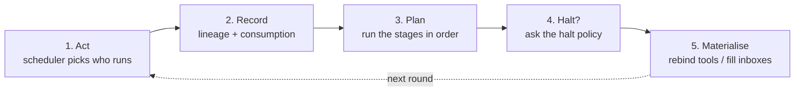

# Adaptive topology

A [`Colony`][ant_ai.a2a.colony.Colony] wires collaboration edges once, with `collab()`. An
**adaptive topology** recomputes them at runtime: which agents can reach which is decided per round
instead of at construction.

The mechanism deliberately keeps two things apart:

| | Decided by |
| --- | --- |
| **Reachability** — who is in my address book this round | the topology layer |
| **Selection** — whom I actually talk to | the agent: a tool call under visibility, `Envelope.recipients` under delivery |

There is no router agent. Each participant publishes its own natural-language **query** ("what I
need") and **key** ("what I offer"), and the matcher is a mechanical cosine comparison over those
self-descriptions — both sides of every comparison are text an agent wrote about itself. The
AgentCard stays the channel: it is the *static* half of a participant's advertisement, and the
descriptors are the *dynamic* half. What changes each round is which cards are in scope.

## Quick start

```python
from ant_ai.a2a import Colony

colony = Colony()
colony.agent("architect", agent=architect, workflow=wf, card=card_a)
colony.agent("developer", agent=developer, workflow=wf, card=card_d)
colony.agent("reviewer", agent=reviewer, workflow=wf, card=card_r)

colony.collab("architect", "developer", mutual=True)  # the round-0 seed

colony.evolve("dytopo")

ensemble = colony.ensemble()
async for event in ensemble.stream("Build a CSV parser"):
    ...

print(ensemble.report())
```

A strategy is named, not imported. `"dytopo"` is semantic rewiring, `"dig"` is structural repair,
and `"dytopo|dig"` is both layered — the same thing `DyTopo() | DigToHeal()` builds, and the form
an ablation sweep varies. `EvolutionStrategy.known()` lists them.

Pass an instance instead when you need to configure one:

```python
from ant_ai.topology.builtins import DyTopo

colony.evolve(DyTopo(tau=0.4, k_in=5))
colony.evolve("dytopo", tau=0.4)  # equivalent, for a single name
```

`"dytopo"` embeds with `all-MiniLM-L6-v2` — the encoder the paper used — which needs the optional
extra:

```bash
pip install 'ant-ai[topology]'
```

A colony with no `topology()` call behaves exactly as before: `collab()` edges are the static
topology, materialised as peer tools.

### The configuration is checked before it runs

`colony.ensemble()` validates what you assembled and raises
[`TopologyConfigurationError`][ant_ai.topology.problem.TopologyConfigurationError] on a
combination that provably cannot work:

```
This topology cannot run as configured:
[E001] Semantic, Heal read fields only a structured turn carries, but
       workflow-driven participants cannot be invoked with a response schema.
  Fix: Use `ensemble(local=True)` with the default `use_workflows=False`, or
       choose a strategy that does not need structured turns.
```

| | |
| --- | --- |
| `E001` | a component reads declared fields that nothing will declare |
| `E002` | delivery mode with no links, no declared edges and no addressing — nothing can reach anyone |
| `E003` | remote participants with a topology materialised as peer tools, which cannot bind |
| `E004` | a workflow that will drive the turns and cannot run — every activation would fail |
| `W001` | nothing can declare `submitted`, so the round budget decides the length |
| `W002` | a strategy configured over fewer than two participants |
| `W003` | the response schema will be coerced, not constrained: a second LLM call per turn, with the declared fields filled by a repair model |
| `W004` | a stage on a cadence whose period does not fit inside the round budget, so it fires at most once |

Two more are reported by [`StateGraph`][ant_ai.topology.state.StateGraph] about an *edit* rather
than a configuration — `E101` for an edge between node kinds the schema forbids, `E102` for a
deletion that would leave edges dangling. Those never raise during a run: the edit is logged as
unapplied and surfaces as `RunReport.rejected`.

Each check fires only where the outcome follows from the configuration alone. Construct
[`Ensemble`][ant_ai.topology.runtime.Ensemble] directly to bypass them.

### Reading the result

The layer's failure mode is a run that completes and looks fine. A topology that never moved and a
detector firing every round are both invisible in the answer string, so
[`report()`][ant_ai.topology.runtime.Ensemble.report] is the two-line check:

```
strategy       : dytopo|dig
rounds         : 4  (reviewer submitted)
participants   : architect, developer, reviewer
messages       : 30 generated, 21 delivered, 21 consumed, 9 outstanding
links/round    : r1=6, r2=4, r3=5
rewrites       : feature_updatex2, insertx1, linkx16, unlinkx11
components     : messagex3
activations    : 12 recorded
findings       : MCx1
```

It flags the failures worth catching by eye: a topology that never changed, a detector that fired on
every round, reachability granted that nobody used, and edits the schema refused.

## How a round runs



A decided topology governs the **next** round: it is what participants will act under. Round 0 is
seeded from the colony's declared `collab()` edges.

Halting is asked **after** the stages, not before. Repairing an early termination reroutes a
submit back to its issuer and un-terminates it, which only means anything if the run has not
already ended — checking halting first would make the single most consequential detector unable
to act.

## Core concepts

A strategy is an ordered list of **stages**, each transforming the plan for the next round.

| Concept | Description |
| --- | --- |
| [`Stage`][ant_ai.topology.plan.Stage] | One transform of the next round's plan. The extension point for a routing or repair algorithm. |
| [`RoundPlan`][ant_ai.topology.plan.RoundPlan] | What the next round will look like: turns, scores, links, notices, findings. Stages return a new one rather than mutating. |
| [`RunContext`][ant_ai.topology.plan.RunContext] | The state of the run right now — read-only, so everything a stage writes goes in the plan it returns. |
| [`Detector`][ant_ai.topology.heal.Detector] | Finds one structural failure pattern. Hosted by the `Heal` stage, which owns applying corrections. |
| [`TopologyMaterialiser`][ant_ai.topology.materialise.TopologyMaterialiser] | Turns a plan into reality: `VisibilityMaterialiser` rebinds peer tools, `DeliveryMaterialiser` routes messages. |
| [`Scheduler`][ant_ai.topology.schedule.Scheduler] | Who activates on a tick. `RoundScheduler` is the synchronous barrier; `BufferScheduler` activates only agents whose inbox changed. |
| [`Halt`][ant_ai.topology.strategy.Halt] | Who may end a run, and not before which round. |
| [`InteractionGraph`][ant_ai.topology.graph.InteractionGraph] | The run record: activations, messages, and both granted and exercised edges. |
| [`EvolutionStrategy`][ant_ai.topology.strategy.EvolutionStrategy] | A published method's hyperparameters plus how they assemble, via one hook: `build()`. |
| [`Ensemble`][ant_ai.topology.runtime.Ensemble] | The round loop. |

The record answers *what happened*; a strategy says *what it means*. `InteractionGraph` will tell
you which messages nothing consumed; whether that is a failure, and after how long, is a published
method's claim and lives with it in `ant_ai.topology.builtins`.

### Edge direction

`Link(src, dst)` is **information flow**: `src` offers, `dst` needs.

- Delivery pushes `src`'s message into `dst`'s inbox — direct.
- Visibility gives **`dst`** a tool that calls **`src`**, because `dst` is the one that needs what
  `src` offers. The tool binding is the *reverse* of the arrow.

`Colony.collab(source, target)` means *source may call target*, so a colony records its declared
edges as `Link(src=target, dst=source)`.

### Addressing

Under delivery, the two halves of that split meet in one rule:

```
delivery = selection ∩ reachability
```

**Selection** is [`Envelope.recipients`][ant_ai.topology.participant.Envelope] — whom the sender
addressed, in its own words, elicited in the same single pass as everything else
(`TurnPayload.messages`). **Reachability** is `plan.links`. Each side has a default, and the
defaults are what let two very different published methods run through one materialiser:

- A sender that addressed **nobody** is routed by the links — a matcher-driven run, unchanged.
- A round **no stage wrote links for** has no opinion on reachability, so an addressed message goes
  where it was addressed. That is a method whose agents name their own correspondents, with no
  matcher under it at all.
- A message addressed to somebody unreachable is **not** delivered. It stays a generated event that
  reached no one — which is the failure `OrphanedEvent` reports, and silently widening reachability
  to whoever was named would erase the pathology instead of surfacing it.

A turn therefore carries `outputs`, a list, not a public/private pair: one activation splitting work
five ways sends five different messages, not one broadcast five agents happen to read. `public` and
`private` remain as accessors and as constructor shorthand for the common case.

### Reactions

A participant also says what it *did* with each message it was handed — `consume`, `wait`,
`discard`, or `reroute` to someone better placed — keyed by the `[eN]` tag the brief gave it:

```python
TurnPayload(reactions={"e1": "wait"}, reroute={"e2": ["reviewer"]})
```

Anything unmentioned counts as consumed. The reaction is what the `delivers` edge records, so the
record says what happened rather than what the scheduler assumed, and three things follow from it:
a waited message stays in the buffer and stays outstanding, lineage is attributed from what was
*consumed* rather than from everything delivered, and `ExcessiveRerouting` counts a message being
bounced whether the bouncing was an agent's decision or a supervisor's.

## Using a strategy

Strategies live in `ant_ai.topology.builtins`, one module per paper. Import them when you need to
configure or compose one; name them as a string otherwise.

```python
from ant_ai.topology.builtins import DyTopo, chain, mesh, star

colony.evolve(mesh(["architect", "developer", "reviewer"]))
colony.evolve(DyTopo(tau=0.35, k_in=3))
```

Hyperparameters are validated fields, so `DyTopo(tau=2.0)` fails at construction rather than
producing a quietly meaningless run, and `strategy.provenance()` reports them without a
hand-maintained dict.

### Composing

Two strategies layer with `|`. Stages concatenate; for every other component the right-hand side
wins, but **only** where it set that component explicitly — so composing never reverts a setting
to a default:

```python
strategy = DyTopo() | DigToHeal()  # or: colony.evolve("dytopo|dig")
```

That yields DyTopo's `Semantic` and `TopK` stages followed by DIG's `Heal`, DIG's scheduler and
materialiser, and a provenance record naming both halves. Neither strategy knows the other exists.

## Adding a strategy

A new method answers up to four questions, and overrides only the ones its paper actually changes:

| Question | Seam |
| --- | --- |
| What changes — reachability, or anything else? | a `Stage`, returning `Rewrite`s |
| What counts as broken? | a `Detector`, hosted by `Heal` |
| Who acts when? | a `Scheduler`, and `Every` for a slower second clock |
| Who says stop? | a `Halt` |

Then one module under `builtins/`, with a `EvolutionStrategy` whose single hook assembles them:

```python
class MyMethod(EvolutionStrategy):
    name = "mine"
    citation = "arXiv:..."

    threshold: float = Field(0.5, ge=0.0, le=1.0)  # validated, recorded in provenance

    def build(self) -> Pipeline:
        return Pipeline(stages=[MyStage(threshold=self.threshold)])
```

Nothing in the core changes, and the strategy registers itself by name:

```python
strategy = EvolutionStrategy.create("mine", threshold=0.7)
```

A stage is one async method. It holds no participant handles, performs no I/O on the run and
cannot deliver anything, so it can be replayed against a recorded trace with no agents running:

```python
class Decay(BaseModel):
    """Halve the weight of every edge that survived from last round."""

    async def apply(self, plan: RoundPlan, ctx: RunContext) -> RoundPlan:
        previous = {(l.src, l.dst) for l in ctx.graph.links(ctx.round)}
        return plan.with_links(
            tuple(
                l.model_copy(update={"weight": l.weight / 2})
                if (l.src, l.dst) in previous
                else l
                for l in plan.links
            )
        )
```

Scoring and sparsifying are separate stages because nearly every routing method is those two
steps. `RandomTopology` reuses DyTopo's own `TopK` unchanged, so a random control holds sparsity
constant by construction rather than by careful reimplementation.


## Evolving more than the wiring

A stage's output is a typed **rewrite**, and reachability is only its communication-edge case. The
same nine operators — `insert`, `delete`, `feature_update`, `merge`, `link`, `unlink`, `rewire`,
`edge_feature_update` and the read-only `activate` — apply to memories, tools, skills and workflows,
which is what a method whose delta is not the wiring needs in order to be a stage at all.

```python
from ant_ai.topology import Every, Rewrite


class Distil:
    """Turn what worked this round into a reusable skill."""

    writes_nodes = True

    async def apply(self, plan, ctx):
        return plan.with_rewrites(
            Rewrite.insert("skill", f"skill-r{ctx.round}", label="distilled").caused_by(
                "distil", at=ctx.round
            ),
        )


colony.evolve(DyTopo() | MyMethod())  # every round
Pipeline(stages=[Semantic(...), TopK(...), Every(stage=Distil(), k=3)])  # every third
```

`with_links()` is unchanged and still replaces the graph wholesale — it now also records the diff
that got there, which is what `RewriteLog` needs. Nodes live in
[`StateGraph`][ant_ai.topology.state.StateGraph], which is passed *into* an `Ensemble`, so what a
run evolves can outlive it:

```python
state = StateGraph()
ensemble = colony.ensemble()
ensemble.state = state  # or Ensemble(..., state=state)
await ensemble.ainvoke("first task")

ensemble.log.cascade(cause)  # the edits one finding produced
ensemble.log.cross_component()  # causes touching two or more component types
ensemble.log.rollback(state, to=2)  # undo everything from round 2 on
state.affected("some-tool")  # what a change to it would reach
state.at(2)  # the graph as it was, for a leakage-free question
```

### Recording what a decision was grounded in

Retrieval, tool selection and peer binding are the same read-only operation: a query picks a subset
of a persistent graph, and nothing changes. Recorded, that subset is a `SupportSubgraph` — and
without it there is no way to ask whether a decision used the right evidence, or evidence that did
not exist yet.

```python
from ant_ai.topology import RecordingMemory

memory = RecordingMemory(inner=Mem0Memory(...), state=state, log=ensemble.log)
memory.tick(round)  # decision time; retrieval past it is dropped

support_accuracy(state, gold={"mem:act:3:1": {"mem:abc123"}})  # Dice against a gold set
leaked(state, state.supports[-1])  # evidence written after the fact
locality(
    ensemble.log, since=2, probes=["some-skill"]
)  # what an edit could not have reached
```

Peer binding is recorded the same way, on by default — `Ensemble(record_reachability=False)` turns
it off for a long run where one entry per participant per round is more record than the question
needs.

## Halting

Who may end a run is a **method** choice, not a framework constant. Left implicit it silently
distorts comparisons: with agent-declared halting, the first agent to finish its own piece ends
everyone's round, so two conditions run for different numbers of rounds and their token totals stop
being comparable.

One class with three knobs, set on a strategy's `Pipeline`:

```python
Halt()  # anyone may end the run (default)
Halt(unanimous=True)  # everyone must agree
Halt(deciders={"integrator"}, min_rounds=3)  # only the manager, and not before round 3
Halt.never()  # pin the round budget
```

Two independent constraints in one rule rather than two objects nested. `min_rounds` exists
because a weak completion signal — docstring examples passing, say — otherwise ends a run at
round 1 on false confidence and the topology never gets a second round to rewire.

## Self-healing

A [`Detector`][ant_ai.topology.heal.Detector] finds one structural failure pattern; a
[`Heal`][ant_ai.topology.heal.Heal] is the stage that runs a set of them and applies what they
prescribe. The split is the point: what varies between healing methods is the *detectors*, not the
mechanics of rewriting a message.

```python
from ant_ai.topology.builtins import DigToHeal, dig_detectors

colony.evolve("dytopo|dig")  # routing plus repair
colony.evolve(strategy, detectors=dig_detectors()[:2])  # a one-off subset, or your own
```

`DigToHeal` implements [arXiv:2603.00309](https://arxiv.org/abs/2603.00309). Its seven detectors:

| | Pattern | Fires when | Correction |
| --- | --- | --- | --- |
| `ET` | Early Termination | a submit lands while work is unconsumed | inject what is outstanding, reroute the submit back to its issuer — which **un-terminates** it, so the run continues |
| `MC` | Missing Completion | work is exhausted and nobody submitted | emit "the work is done, somebody call it" |
| `OE` | Orphaned Event | a message was routed to nobody | inject status, reroute to its generator |
| `DL` | Deadlock | work is pending and nobody activated | emit a broadcast to restart activity |
| `ER` | Excessive Rerouting | one message rerouted past a threshold, never consumed | inject that fact into the payload |
| `CLA` | Cross-Lineage Aggregation | one activation consumed messages with disjoint ancestry | inject the lineage into each |
| `RSP` | Repeated Subproblem | two problem-reducing activations consumed the same input | tell both they may be duplicating |

Writing a new one is a single async method over the graph:

```python
class Starvation(Detector):
    pattern: str = "STARVE"

    async def detect(self, graph, ctx):
        idle = [n for n in ctx.names if not graph.in_neighbours(n, ctx.round)]
        return [
            self.finding(
                ctx,
                f"{n} heard from nobody",
                Intervention(kind="emit", content="...", recipients=(n,)),
            )
            for n in idle
        ]
```

A detector holds no participant handles, performs no I/O and cannot deliver anything, so it can be
developed and falsified against a recorded trace with no agents running. Every finding also reaches
the caller as a [`HealingEvent`][ant_ai.core.events.HealingEvent] — healing that leaves no trace on
the stream is indistinguishable from a run that never needed it.

### Why the scheduler matters here

Four of the seven detectors are unreachable under a synchronous barrier. If every agent acts every
round then `V_A(t)` is never empty and `Deadlock` is dead code; an agent nobody routed to still
burns a turn, so `OrphanedEvent` never manifests. `BufferScheduler` activates only participants
whose inbox changed, which makes an empty activation set a legitimate state a detector can see.
`DigToHeal` selects it by default.

## Comparing strategies

There is no benchmark harness in the library. What the library gives you is the
*comparability*: every strategy runs through the same `Ensemble`, leaves the same
`InteractionGraph` to measure, and records its own `provenance()`. The loop over conditions is
yours, and it is short:

```python
from ant_ai.topology import Ensemble
from ant_ai.topology.builtins import Baseline, DigToHeal, DyTopo

dytopo = DyTopo(max_rounds=6)

for label, strategy in {
    "no method": Baseline(max_rounds=6),
    "dytopo": dytopo,
    "dytopo + healing": dytopo | DigToHeal(),
}.items():
    ensemble = Ensemble(
        participants=build_participants(),  # fresh per run — agents carry state
        pipeline=strategy.pipeline(),
        provenance=strategy.provenance(),
    )
    answer = await ensemble.ainvoke(task)
    print(label, score(answer), len(ensemble.graph.rounds()), ensemble.findings)
```

Building participants fresh for every run matters: agents carry conversation state and peer
bindings, so reusing them leaks one condition's history into the next.

`examples/_bench.py` is a fuller version of that loop — repeats, structural metrics off the
graph, findings per pattern, a markdown table — kept in `examples/` rather than shipped, because
which metrics matter and how to aggregate them are a researcher's call, not the framework's.
`examples/dig_healing.py` uses it, offline.

## Explainability

Every routing decision reaches the caller as a
[`TopologyEvent`][ant_ai.core.events.TopologyEvent], one per round, whose links carry the score and a
human-readable reason.

```python
async for event in ensemble.stream(task):
    match event:
        case TopologyEvent():
            for link in event.links:
                print(event.round, link.src, "->", link.dst, link.reason)
```

The `InteractionGraph` records reachability the policy *granted* and calls the agent actually
*made*, separately. Their difference is signal:

```python
ensemble.graph.unused_visibility(round=2)  # peers reachable but never called
ensemble.graph.to_mermaid()  # per-round diagram
```

The graph is plain pydantic, so a whole run round-trips through `model_dump_json()` and can be
analysed — or replayed into a supervisor — with no agents running.

### Watching one happen

`examples/dig_in_action/` draws the graph while the run is still going: activations appear as they
start, the time axis grows, and a repair shows up at the moment the supervisor makes it. It is a
live rebuild of the figure from the [DIG page](https://happyeureka.github.io/dig/), fed by
`Ensemble.stream` over SSE, and it runs offline with no model behind it.

```bash
uv run python -m examples.dig_in_action
```

The projection there takes an `InteractionGraph`, not a run, so the same page draws a recorded
trace with nothing running — and pointing it at a colony of real agents is a change of one factory
function.

## Limitations

- **Workflows and structured turns.** `Workflow.stream` takes no response schema, so a
  workflow-driven participant answers with one plain public message: no query/key descriptors, no
  addressed messages, no declared reactions and nothing ever submitted. A strategy built on any of
  those does not go quiet — it reports on the defaults instead: a matcher scores unchanging
  AgentCard text, and the structural detectors fire every round on deliveries nobody declared. So
  `use_workflows` defaults to False, and asking for the combination raises `E001` rather than
  running. A component opts into the requirement with `needs_structured_turns = True`.
- **Remote peers cannot be rebound.** A2A has no operation for attaching a tool to an agent in
  another process, and it carries no response schema either — so a remote run is unstructured
  however the colony is configured. `A2AParticipant` adapts under `DeliveryMaterialiser` with a
  strategy that reads nothing declared; anything else raises at build time (`E001` for a strategy
  needing structured turns, `E003` for a topology materialised as peer tools).
- **Declared edges are the fallback, not a floor.** `collab()` edges seed round 0 and stand in
  every later round no stage overwrites, which is what lets a repair-only strategy route at all. A
  stage that writes links replaces them outright rather than adding to them.
- **Synchronous rounds.** Both schedulers still advance on a round barrier, so `BufferScheduler`
  gives event-driven *activation* but not event-driven *timing*: an agent acts at the next barrier
  rather than the instant its buffer changes, and turns that share a round start together. That
  costs latency realism, not detectability, and it is the last structural difference from a runtime
  whose agents fire the moment their mailbox changes.
- **Detection is per round.** `Heal` runs its detectors once per round, after the stages. A method
  that hooks activation-complete, event-delivered and idle separately would see the same conditions
  at a finer grain; the queries themselves are unchanged by that.
- **Message-level healing needs delivery mode.** DIG detects when an event is generated, before it
  is delivered. Under `VisibilityMaterialiser` a peer call collapses generation, delivery and
  activation into one synchronous tool call, so there is nothing to inspect in between. This is why
  [`DigToHeal`][ant_ai.topology.builtins.dig.DigToHeal] pairs its detectors with
  `DeliveryMaterialiser`: every intervention kind (`inject`, `reroute`, `drop`, `emit`) is applied
  by the round loop, against messages that exist as messages.
- **Unaddressed output still needs a topology.** A message that names no recipients is delivered by
  the links, so a run with neither addressing nor a routing stage moves nothing. Structural
  accounting settles a turn's outputs together (see `InteractionGraph.siblings`), which is what
  keeps the copy a turn leaves for the record from being reported as an orphan when its addressed
  sibling was delivered.
- **Stage order is load-bearing.** A sparsifier must follow the scorer whose `plan.scores` it
  reads. That is the honest cost of composing by concatenation: it is visible in the list, but
  nothing type-checks it.
- **Rollback undoes the graph, not the world.** `RewriteLog.rollback` restores `StateGraph` from the
  inverses it recorded. It does not un-send a message, un-call a tool, or reach into the backend a
  `RecordingMemory` wraps — those are effects the log observed rather than owns.
- **`purge` is the only real deletion.** `delete` tombstones, which is right for audit and wrong for
  compliance: the content is still in `attrs`. `StateGraph.purge` drops the record and returns the
  components whose derivations still carry its influence, which is the set the caller has to
  revalidate.
- **Locality is a bound, not a measurement.** A probe inside an edit's affected scope has not
  necessarily changed — only that this edit could have reached it.
