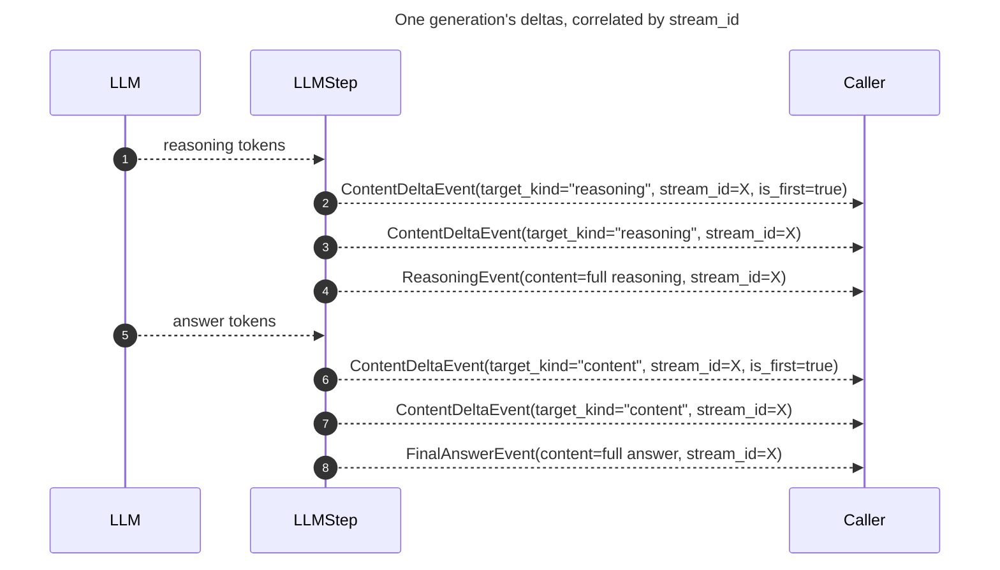

# Live token streaming

`agent.stream()` streams events as the agent runs: a `ToolCallingEvent` when the model decides to call a tool, a `FinalAnswerEvent` once it answers, and — while each of those is being generated — live [`ContentDeltaEvent`][ant_ai.core.events.ContentDeltaEvent]s carrying its output token by token, before the terminal event they build up to. Consumers that only care about complete messages can match on `FinalAnswerEvent`, `ToolCallingEvent`, or `ReasoningEvent` and ignore the deltas.

## Consuming deltas

```python
from ant_ai.core import ContentDeltaEvent, FinalAnswerEvent

async for event in agent.stream(state):
    if isinstance(event, ContentDeltaEvent):
        print(event.delta, end="", flush=True)
    elif isinstance(event, FinalAnswerEvent):
        print()  # the concatenated deltas equal event.content
```

## The `ContentDeltaEvent` shape

| Field             | Meaning                                                                                     |
| ----------------- | --------------------------------------------------------------------------------------------- |
| `delta`           | The new text fragment only — not the accumulated text so far.                                 |
| `stream_id`       | Groups every delta (and the terminal event) from one LLM generation. A fresh UUID assigned by `LLMStep.stream()` per generation. |
| `target_kind`     | `"content"`, `"reasoning"`, or `"tool_calling"` — what this fragment is building toward.        |
| `is_first`        | `True` for the first delta of a `stream_id` (or `tool_call_index`) group.                      |
| `tool_call_index` | Set when `target_kind == "tool_calling"`, since a turn can stream several tool calls at once.  |

`stream_id` ties a run of deltas back to the terminal event they build up to. A model that reasons before answering streams a `reasoning`-kind group first, then a `content`-kind group, both sharing the same `stream_id` as the `ReasoningEvent`/`FinalAnswerEvent` that closes each out:



## When it isn't live

!!! warning
    Two things force the whole-event path for a given turn:

    | Gate                                               | Why                                                                             |
    | ------------------------------------------------- | -------------------------------------------------------------------------------- |
    | A hook overrides `after_model` / `wrap_model_call` | It may need the complete response to decide — tokens already sent can't be retracted. |
    | Structured output's coercion repair call           | May silently rewrite the raw text into valid JSON.                                |

A hook whose `after_model`/`wrap_model_call` override never changes the outcome (e.g. read-only logging) can opt back in by declaring `stream_safe = True`:

```python
from ant_ai.hooks import AgentHook, PostModelPass


class LoggingHook(AgentHook):
    stream_safe = True  # never returns anything but PostModelPass

    async def after_model(self, result, ctx):
        logger.info(result.output.raw)
        return PostModelPass(result=result)
```

## Over A2A

An [`Agent`][ant_ai.agent.agent.Agent]'s own `stream()` always emits deltas internally, regardless of how it's served. Whether an [A2A](../multi-agent/index.md) server forwards them to the caller is a separate, per-agent setting: `stream_artifacts` on `colony.agent()` (default `True`).

```python
colony.agent(
    "assistant",
    agent=agent,
    workflow=workflow,
    card=card,
    stream_artifacts=True,  # default; set False to stop forwarding deltas as A2A artifact events
)
```

### Artifact IDs

Deltas are translated into A2A's own [`TaskArtifactUpdateEvent`](https://a2a-protocol.org/latest/sdk/python/api/a2a.html#a2a.types.TaskArtifactUpdateEvent) chunks, part of the A2A spec. Reasoning, content, and each tool call stream under their own artifact ID:

| Delta kind                  | Artifact ID                          |
| ---------------------------- | --------------------------------------- |
| `target_kind="content"`      | `{stream_id}:content`                   |
| `target_kind="reasoning"`     | `{stream_id}:reasoning`                 |
| `target_kind="tool_calling"`  | `{stream_id}:tool:{tool_call_index}`     |

The terminal whole-message status update is always sent too, so a peer that doesn't read artifacts sees no difference.

### Hive-internal agents

An agent called mainly by other agents, via [`A2AAgentTool`][ant_ai.a2a.agent.A2AAgentTool] in a [`Colony`](../multi-agent/index.md), gains nothing from `stream_artifacts=True`: the caller consumes the result as one string once the call completes and discards every delta. Set it `False` for agents that are purely hive-internal collaborators.
