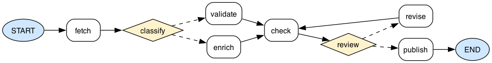

# Visualizing Workflows

`ant-ai` can render any [`Workflow`][ant_ai.workflow.workflow.Workflow] as a diagram. Nodes appear as rectangles, `START` and `END` as ellipses, and conditional edges as diamond decision nodes with dashed outgoing arrows to each possible destination.

## Installation

The visualizer wraps the [Graphviz](https://graphviz.org/) library. Install both the Python package and the system CLI:

```sh
uv add ant-ai[viz]

# macOS
brew install graphviz

# Ubuntu / Debian
sudo apt-get install graphviz
```

## Jupyter notebook

Call [`build_workflow_graph()`][ant_ai.workflow.visualize.build_workflow_graph] and make it the last expression in a cell — the returned `Digraph` object renders inline via its `_repr_svg_()` method:

```python
from ant_ai.workflow import build_workflow_graph

build_workflow_graph(wf)
```

## Export to file

[`render_workflow()`][ant_ai.workflow.visualize.render_workflow] writes the diagram to disk and returns the output path.

```python
from ant_ai.workflow import render_workflow

# Raster / vector
render_workflow(wf, "diagram", format="png")
render_workflow(wf, "diagram", format="svg")
render_workflow(wf, "diagram", format="pdf")

# LaTeX — produces a self-contained .tex file with a tikzpicture
render_workflow(wf, "diagram", format="latex")
```

### LaTeX output

The `latex` format generates a standalone `diagram.tex` compilable with `pdflatex`:

```tex
\documentclass{standalone}
\usepackage{tikz}
\usetikzlibrary{shapes.geometric, arrows.meta, positioning}
\begin{document}
\begin{tikzpicture}[
  every node/.style={font=\small},
]
  ...
\end{tikzpicture}
\end{document}
```

To embed it in an existing document, copy the `tikzpicture` block or use `\input{diagram.tex}` with an appropriate preamble.

## Layout direction

The default layout is left-to-right (`rankdir="LR"`). Pass `rankdir="TB"` for a top-to-bottom layout instead:

```python
build_workflow_graph(wf)                          # left-to-right (default)
render_workflow(wf, "diagram", format="png")      # left-to-right (default)
render_workflow(wf, "diagram", format="png", rankdir="TB")  # top-to-bottom
```

## How conditional edges are resolved

The visualizer inspects the router function's source code with Python's `ast` module and collects every literal string in a `return` statement. Each one becomes a dashed outgoing edge from the decision diamond:

```python
def my_router(agent, state, ctx) -> Literal["validate", "publish"]:
    if state.last_message.content == "retry":
        return "validate"   # ← edge 1
    return "publish"        # ← edge 2
```

Variable returns (e.g. `return node_name`) are not collected — use string literals in router functions.

## Example

The diagram below is produced by the following workflow:

```python
from typing import Literal
from ant_ai.workflow import Workflow, render_workflow
from ant_ai.workflow.workflow import START, END

w = Workflow()

async def noop(agent, state, ctx): ...

for node in ("fetch", "enrich", "validate", "check", "publish", "revise"):
    w.add_node(node, noop)

def classify(agent, state, ctx) -> Literal["enrich", "validate"]:
    if state.last_message.content == "enrich":
        return "enrich"
    return "validate"

def review(agent, state, ctx) -> Literal["publish", "revise"]:
    if state.last_message.content == "approved":
        return "publish"
    return "revise"

w.add_edge(START, "fetch")
w.add_conditional_edge("fetch", classify)   # → enrich or validate
w.add_edge("validate", "check")
w.add_edge("enrich", "check")
w.add_conditional_edge("check", review)    # → publish or revise
w.add_edge("revise", "check")              # retry loop
w.add_edge("publish", END)

render_workflow(w, "diagram", format="png")
```

The resulting diagram looks like this:


