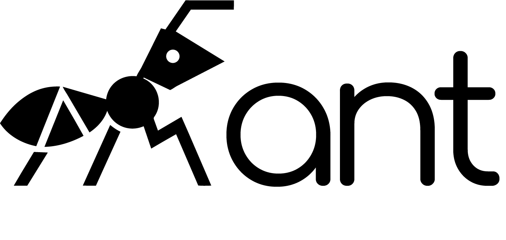

<div style="text-align: center;">
  
  
</div>

`ant-ai` is a lightweight Python framework for building multi-agent AI systems — from a single agent to a full colony of collaborating peers.

## Quick start

```python
import asyncio

from ant_ai import Agent, InvocationContext, Message, State, tool
from ant_ai.llm.integrations import LiteLLMChat


@tool
def add(x: int, y: int) -> int:
    """Add two numbers."""
    return x + y


agent = Agent(
    name="Calculator",
    system_prompt="You are a helpful calculator.",
    llm=LiteLLMChat("gpt-4o-mini"),
    tools=[add],
)


async def main():
    ctx = InvocationContext(session_id="demo")
    state = State()
    state.add_message(Message(role="user", content="What is 3 + 4?"))

    async for event in agent.stream(state, ctx=ctx):
        if event.content:
            print(event.content)


asyncio.run(main())
```

## Next steps

- **[Install](docs/install/index.md)** — get `ant-ai` installed in your project.
- **[Single-agent guide](docs/single-agent/index.md)** — build an agent with tools.
- **[Multi-agent guide](docs/multi-agent/index.md)** — connect agents in a Colony.
- **[Architecture](docs/architecture/index.md)** — how events flow through the system.
