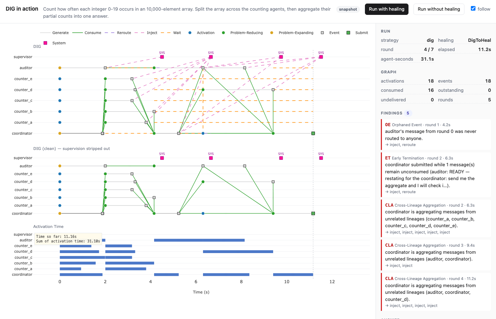

# DIG in action

A live replica of the real-time figure from the
[DIG page](https://happyeureka.github.io/dig/) — the one where the interaction
graph draws itself to the right as the run happens — except that the graph
being drawn is this framework's own
[`InteractionGraph`][ant_ai.topology.graph.InteractionGraph], produced by a real
`Ensemble` running `DigToHeal`, not a recording.

```bash
uv run python -m examples.dig_in_action        # opens http://127.0.0.1:8765/
```

Nothing is needed beyond the base install: no API key, no model, no optional
extras. The page needs a network connection the first time, for Plotly from its
CDN.



## What you are looking at

Three panels sharing one time axis, growing as the run proceeds:

| Panel | Shows |
| --- | --- |
| **DIG** | the whole record — messages, consumption, and every supervisor rewrite |
| **DIG (clean)** | the same run with the supervision stripped out: what the agents did |
| **Activation Time** | how long each turn actually took, and what the run cost in agent-seconds |

The encoding is the paper's:

| Mark | Means |
| --- | --- |
| circle | an activation — one participant taking one turn |
| gold / green circle | DIG's classification: problem-**expanding** vs problem-**reducing** (`is_problem_reducing`) |
| hollow circle | a turn that is running right now |
| square | an event: one message an activation generated |
| green square | a submit: the message claiming the task is done |
| magenta square, `SYS` | the supervisor — a message it emitted, or a round it intervened in |
| grey line | `generates`: the turn that produced the message, spanning its duration |
| green line | `consume`: the delivery an activation actually took in |
| dashed purple / pink / red | `reroute`, `inject`, `discard` — a repair, at the moment it was applied |
| dashed orange | *wait*: a round a participant did not activate in, or a message it kept for later |

Lanes are participants, `supervisor` on top. Hover anything — a node gives the
phase, the classification, what it consumed and what it generated; an edge gives
the action and the reason recorded on it; `SYS` gives every correction that round.

## The scenario

The paper's own demo task, CountFrequency: an array of 10,000 integers, one
coordinator that splits it five ways, five agents that count their slice, and an
auditor that verifies the total.

There is **no routing stage**, which is how the [reference
implementation](https://github.com/HappyEureka/dig) runs: every message names
its own recipients, and a round nothing decided reachability for delivers each
message where its sender addressed it. So the coordinator sends five different
chunks to five agents rather than one broadcast five agents read; it *waits* on
partials rather than consuming them as they trickle in, so an unsettled partial
is visibly outstanding work; and the auditor's opening message — addressed to
nobody, because at round 0 it has not been told who is coordinating — is a real
orphan for `OrphanedEvent` to find and hand back. One agent's chunk takes two
rounds. The
coordinator's flaw is a single line — it treats four results out of five as good
enough — and it is invisible in the transcript, because the answer it writes
looks finished:

> FINAL — counted 8000 of 10000 values from 4 of 5 chunks.

That is the comparison the two buttons in the header run, on the same cast, the
same schedule and the same clock:

| | Ends | Answer |
| --- | --- | --- |
| **without healing** | round 2 | 8,000 of 10,000 values — **wrong**, and it does not know |
| **with healing** | round 4 | 10,000 of 10,000 — **correct** |

The unhealed condition is literally the empty pipeline — same scheduler, same
materialiser, nothing supervising — so the two runs differ in one thing.

What happens in between is on screen. `EarlyTermination` sees a submit generated
while a counter's result is still unconsumed, injects what is outstanding into
that message and reroutes it back to its issuer — which also *un-terminates* it,
so the run does not end and the coordinator gets another round. It fires a second
time when the auditor's restatement is in flight past it. `OrphanedEvent` fires
on the auditor's unaddressed opener and hands it back with a note, which is the
correction doing what it was prescribed to do: the auditor restates itself to
the coordinator and is heard. `CrossLineageAggregation` fires on the rounds the
coordinator merges the auditor's line of work with the counters'.

`RepeatedSubproblem` is the one detector left out by default. It asks whether two
problem-reducing turns consumed the same upstream message, which assumes agents
choose their own recipients — one assignment broadcast to five counters makes the
whole cohort look like duplicated work, and the advisory it emits then wakes
every one of them. That is this task's shape, not a fault in the detector, and
`--rsp` puts it back so you can watch it happen.

Two flags change what the flaw is:

```bash
uv run python -m examples.dig_in_action --patience 5   # a stall instead of a premature submit
uv run python -m examples.dig_in_action --think 2.0    # slower turns, easier to watch
uv run python -m examples.dig_in_action --no-heal      # start on the unhealed condition
uv run python -m examples.dig_in_action --rsp         # add the Repeated Subproblem detector
```

The participants are scripted, not model-driven, and deliberately so: the point
of the example is the diagram, and a deterministic cast makes the healed and
unhealed runs differ *only* in the healing. Everything under them is real — they
implement `Participant`, they go through `Ensemble`, and the graph is the
framework's record of what they did.

## Pointing it at your own run

`projection.py` and `server.py` know nothing about the scripted cast. A factory
returning a fresh `(scenario, ensemble)` pair is the whole seam:

```python
from examples.dig_in_action.server import create_app
from ant_ai.topology.builtins import DigToHeal, DyTopo


def factory(*, heal: bool):
    colony = build_my_colony()  # fresh: agents carry state
    strategy = DyTopo(embedder=embedder)
    colony.topology(strategy | DigToHeal() if heal else strategy)
    return my_scenario, colony.ensemble()


app = create_app(factory)
```

`scenario` only has to carry `task`, `order` (the lane order) and a `verdict()`
dict for the side panel. And because
[`project`](projection.py) takes a graph rather than a run, a graph reloaded
from `model_dump_json()` draws exactly the same figure with nothing running.

## Deviations from the original figure

- **Live marks.** A turn still running has no end yet, so it is drawn out to
  *now* as a hollow circle. The original is rendered after the fact and has no
  such state.
- **Rounds are a barrier.** Everyone who activates in a round starts at the same
  instant, so activations line up in columns where the original — event-driven in
  time, not only in activation — staggers them. `BufferScheduler` gives
  event-driven *activation*; the clock is still the round loop's.
- **Wait spans** are computed from the record — a round with no activation for
  that participant — rather than declared by the agent, because
  `BufferScheduler` is what makes an empty activation legitimate here.
- **`?once=1`** freezes the page on the current state instead of subscribing, for
  when you want to keep a frame rather than watch the next one.
